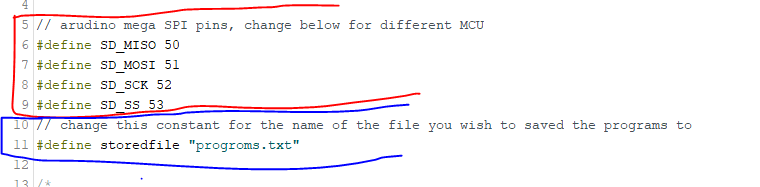
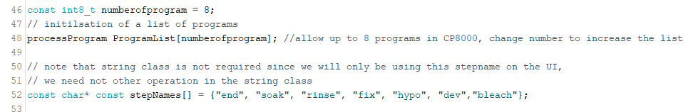
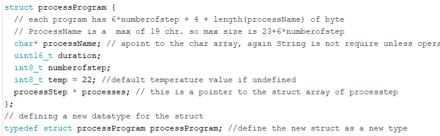
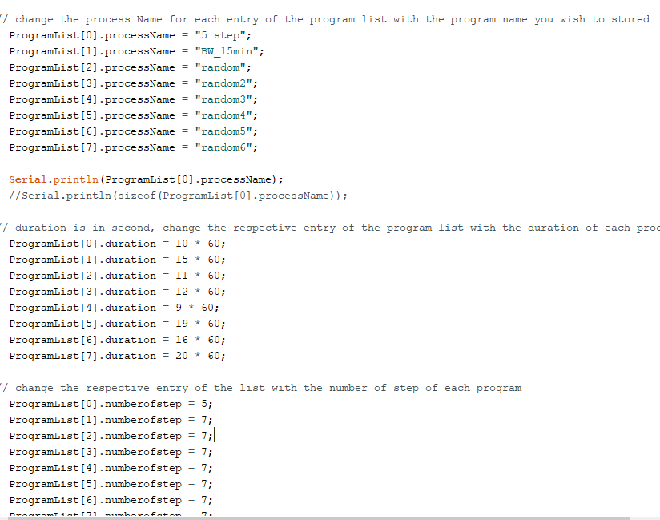
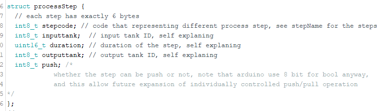
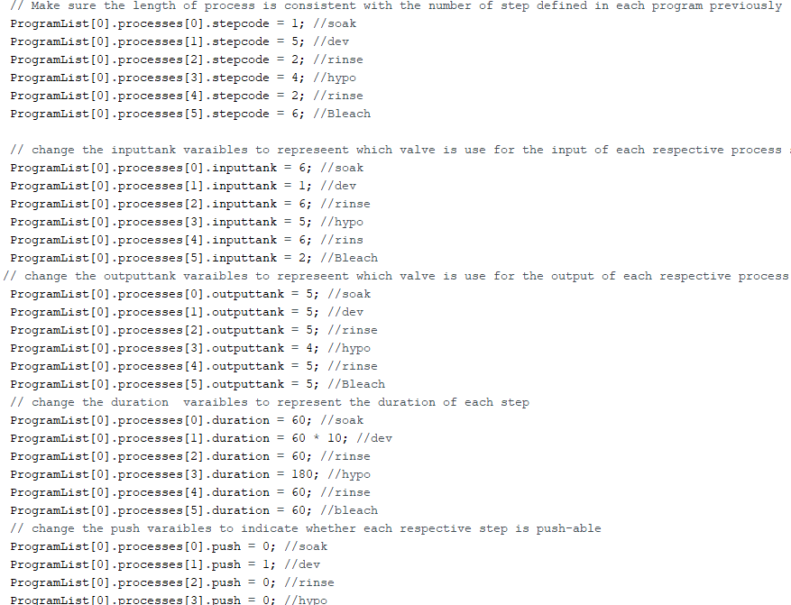

# Instruction: writing program with Arduino script

This is for developers and makers only; the SD card should be programmed
with a more user-friendly method such as web apps. this Arduino script
used to program the SD card is for generating examples for testing the
functionality of loading programs from Sd card, as the name suggests, it
is made to test to store program on SD cards.

Please locate the arduino code: `test_storeProgams.ino`, and make a copy
for you to change the programs. Keep the original file, so it is a
backup.

Please follow the hookup guide to setup the hardware and Arduino before
you make a change to the script. We are using the big SD module, but
they all work in the same way as long as they are hooked up correctly
for the SPI communication.

<https://randomnerdtutorials.com/guide-to-sd-card-module-with-arduino/>

<https://create.arduino.cc/projecthub/electropeak/sd-card-module-with-arduino-how-to-read-write-data-37f390>

## Step 1: Setup the constants

There are three sections of constants you need to define just after the
headers

The first set is the pin assignment for the SD card port, please refer
to the Arduino board for the pin number of the SPI communication

The second section only has one constant that is the name of the file
where you stored the programs, on default it should be a misspelt
document called "progroms.txt", this file could also be renamed later
use a PC by editing the filename.

The last section is the file specific constant, these describe the
general configuration for all the programs hold in this file

The constant of numberofprogram indicates the number of programs you
wish to store in the fie. The constant array of stepName is a lookup
table for the stepCode to indicate what each step is in each process,
please expand the list of stepName with as many variations of step you
have on your machine.

## Step 2: filling in the parameters

There are two set of parameters that need to be filled out, one set is
for each processprogram on the programlist. These parameters describe
the processes of all programs in the files.

The structure of `processProgram` contain a
`processName`, the duration of the entire process, the number of steps in
the process, and the temperature of the entire process, following by the
pointer to an array of process steps that contain the parameters of each
step.

Change these parameter is the `setup()` section of the code.
`ProcessProgram` should be right after `Serial.begin(115200)`;

1.  Name your program within the ProgramList array for each processName
    variable. This could be any name as long as it is below 20
    characters long

    > NOTE: due to the constraint of the memory on the Arduino, it could only
    > load up to 6 different programs, so `ProgramList[6]` and
    > `ProgramList[7]` will never get use.

2.  for each program, type the duration in second to the duration
    variable in each `ProgramList`. Min value: 0, max value: 65,535

3.  type the number of step for each program on `ProgramList` array.
    Min value: 1, max value: 255

4.  type the temp for each program on `ProgramList` array. Min value:
    1, max value: 255

There is no need to define the processes now, we will do it in the next
section.

The other set is for each step within each
program on the program list.

In each step of the process, the step contains the stepcode where
`stepName[stepcode]` return the name of the step, the input tank number,
the duration of the step where the film is bath in the chemical, and the
output tank number, and a flag to indicate whether the step can be
push/pull.

Please copy and paste each line for the variables: `stepcode`, `inputtank`,
`outputtank`, `duration`, `push` to the number of steps you define in the
program section. And then change the value of each variable within the
structure.

The default code contains 8 different programs and the value for the
parameters are placeholder values. Please add more by copy and pasting
the entire list of steps for each program to the number of programs you
defined in Step 1. Please remember to change the index of `ProgramList` so
you are writing a new program in the list not overwrite the old one you
copied the list of steps from.

For each step, the 5 variables of each step have to be filled within
each program. The index should be consistent with the number of steps
you defined in the respective index of program on the ProgramList. The
default should be a long list of placeholder values. Please edit the
code so that the index of process is consistent with the numberofstep
variable defined. None of the step should be skipped or left blank.
These steps should be repeated for each program on the ProgramList.

1)  Step code is the code representing the name of the step from the
    `stepName[]` array defined in Step 1. min value: 0, max value: 255

2)  `inputtank` is the solenoid valve you want your step to use for the
    input chemical, CP800 only has 6 input port, so the valid range of
    value is 1-6 inclusive, any other number will cause error. min
    value: 1, max value: 6

3)  `outputtank` is the solenoid valve you want your step to use for the
    output chemical, CP800 only has 6 input port, so the valid range of
    value is 1-6 inclusive, any other number will cause error. min
    value: 1, max value: 6

4)  Duration is the duration for the step, do not confuse it with the
    duration for the program you defined for the program. Min value: 0,
    max value: 65,535

5)  Push indicate whether the step is pushable, 0 mean no, and 1 is yes.
    If the step is pushable, the push and pull value given before the
    start of the processing will affect the duration of this step, only
    accept 0 or 1 value, anything bigger than 1 is equal to 1. min
    value:0, max value:1
