# V0.92 (in machine after )

Changes:

1)  Removed pull up resistor for direction pin of the motor

2)  Number of extra pins reduced

3)  One additional IDC socket for joystick shield

4)  Pin out header socket for USB host shield, required one additional
    stacking pins

5)  Removed the extra ICSP pins, it is now used by the USB host shield

6)  Use one 5V LDO (AMS1117) onboard required low voltage input of at
    least 6.5V

7)  Arduino mage gets power from Vin around 6.5V and signals powered
    from onboard 5V LDO (AMS1117)

8)  One PISO shift registers for Dpad buttons input are available
    instead of the R-2R ladder analog output to buttons

9)  Red onboard LED for reverse voltage input for both 12V and low
    voltage terminals

10) Green onboard LED for forward voltage input for both 12V and low
    voltage terminals

11) Mounting holes increase from M3 to M4, holes position remains the
    same

12) Size of board increase in the X-axis

## Power circuit

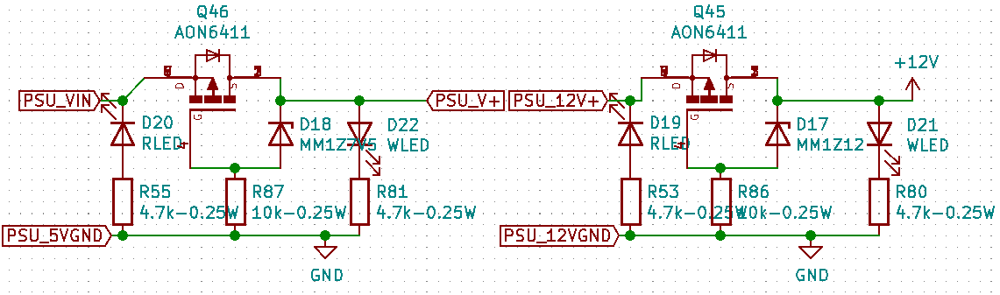

Both 12V and low voltage (6.5V) from the external switch converter are
reverse polarity protected with low on resistance p-channel MOSFET and
Zener diode.

When reverse polarity occurred, the pMOSFET will shut down the main
circuit from the high voltage side, but the red SMD LED will turn on as
an indication for the user that they had reversed the input leads

When the correct polarity is inserted, the pMOSFET will shunt the high
voltage side leads, and activate the green SMD LED.

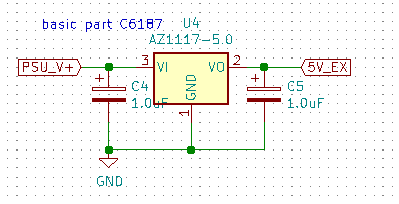

One additional 5V regulator is implemented to share the loads required
by the 5V sources. This is the same chip as the 5V LDO on the Arduino
mega pro mini

In the schematics diagram, 5V is the one powered by the Arduino, while
all 5V_EX connection is powered by this additional chip.

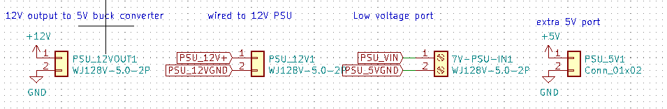

There are four power connectors, one is the input from the 12V PSU, one
is the 12V output after the reverse polarity protection, one is low
voltage input from the buck converter, and the last one is an extra
header for a 5V reference.

## Pumps control

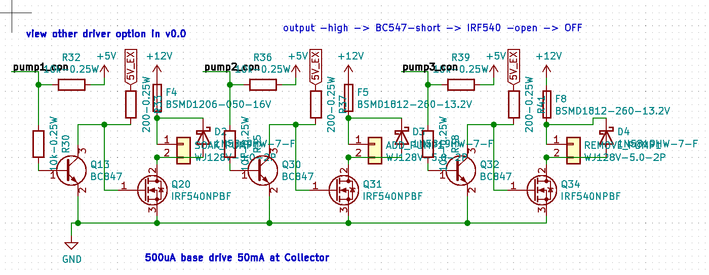Remain unchanged

## Motor control

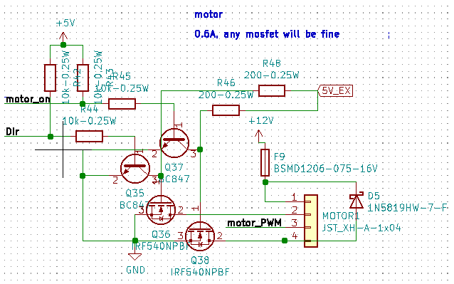

The only changes made are the direction pin of the motor. Now the pin is
left floating/disconnected if it is not shorted to GND for backward
direction

The change is made because the motor we used is not a raw motor, it is a
DIR and PWM controlled motor. Therefore, there is a controller board
inside the motor assembly. Depending on the quality of the motor, if
there is a current path inside the motor assembly, the additional pull
up resistor outside the assembly will affect the voltage level on that
pin.

Also, according to the product datasheet, the DIR pin could be left
disconnected for forward direction, thus proving there is an internal
pull up inside the motor assembly.

The rest is the same as the previous version.

## Solenoid valves control

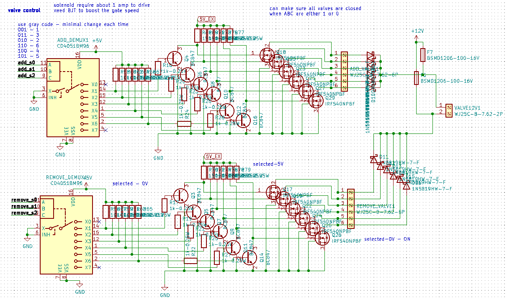Same as previously

## User interface

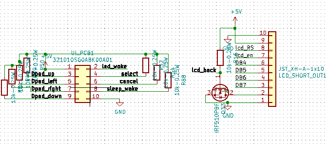

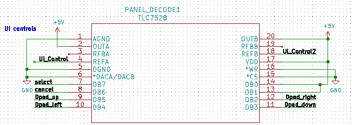

The Dpad function works as previously

In v0.92, there are two additional components added for the user
interface

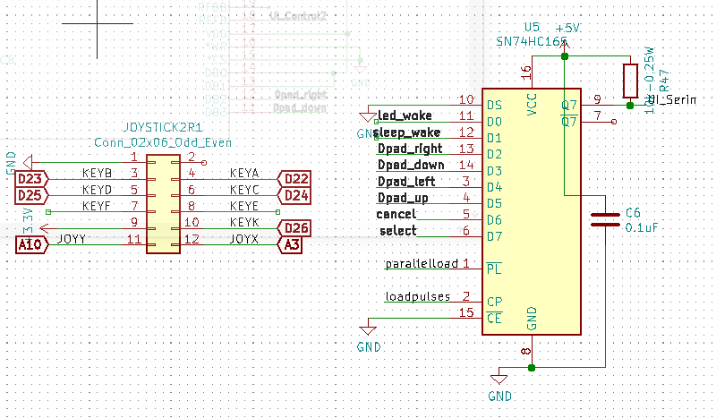

Firstly, the 12ways IDC connector allows the microcontroller to
interface with Arduino joystick shield. Since we don't plan to use key E
and F, they are left disconnected with the microcontroller here. This is
a optional addon, the Dpad functions as usual without the connection
with joystick shield, and the joystick shield will work simultaneously
with the Dpad.

The addition of a parallel in and series out shift register allows pure
digital signal to be transmitted to the microcontroller for all the Dpad
buttons. This required additional programming that allowed the signal to
be read via the UI_Serin input for all 8 buttons.

## Heating element

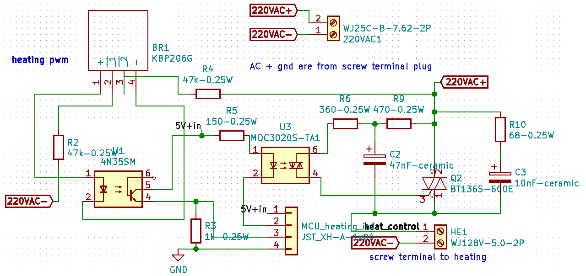

Same as previously

But, DO note that MOC3020, and 4Nm5 might need to be changed to other
equivalent components due to availability.

## Arduino USB Host shield dock

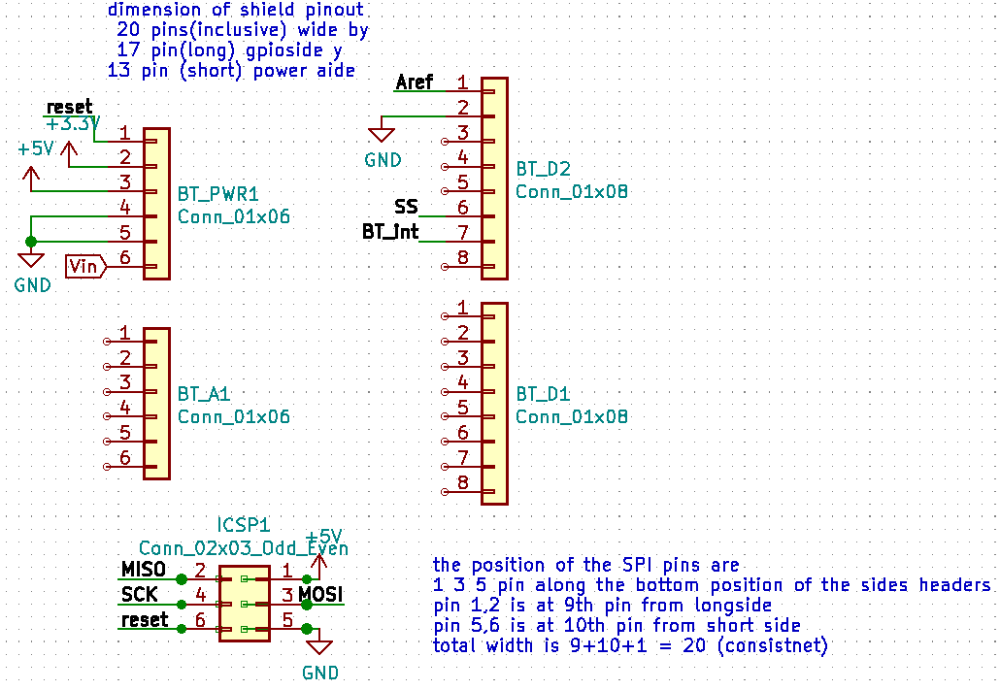

This layout allows the Arduino USB Host shield to be connected simply by
docking it over these docking headers. Most of the bypassing digital and
analog pins from the shield are unuse. They are included for structural
reasons.

The USB host shield converts the USB signal into SPI interface to the
microcontroller.

This has been tested and used with a Bluetooth USB dongle, and
communicates with a PS5 controller to act as the user interface to
navigate the menu.

## Sensors

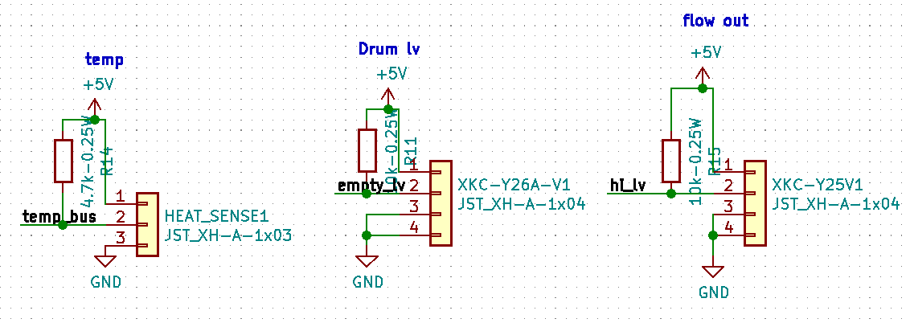

Same as previously

## Buzzer

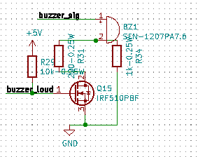

Same as previously

## Communication Ports

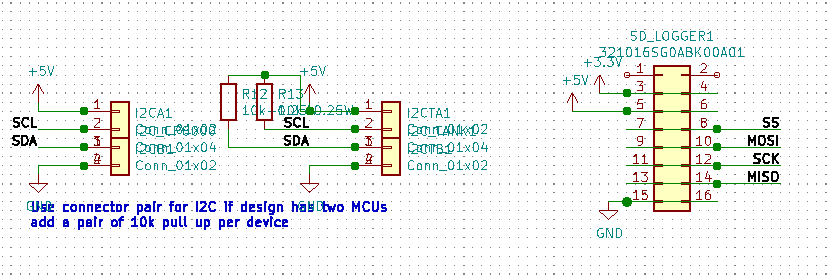

Same as previously

## Microcontroller pinout

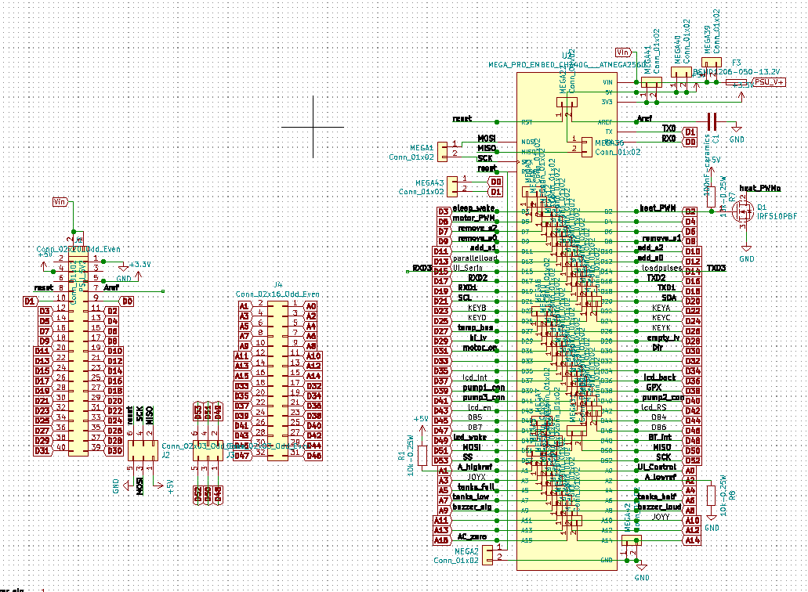The left side of the picture is the header arrangement
on the board for docking the arduino board. The right is the labeled
pinout of the Arduino.

A additional fuse is added to the Vin to the Arduino board, since in
v0.9, power is feed via the 5Vport of the Arduino bypassing the 5V LDO
onboard.

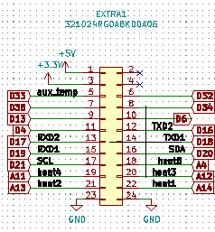

Extra pin unused pin is group to an extra IDC header for future
expansion. This has been significantly reduced due to the module
expansion and component compatibility from v0.9 to v0.92.

The firmware is made backward compatible, so the program being uploaded
to this board that processes all the added component to this iteration
of PCB can also be uploaded to v0.9 without causing a bug. However, all
new features in v0.92 will not reflect on v0.9 unless the corresponding
extra pins are wired externally.

